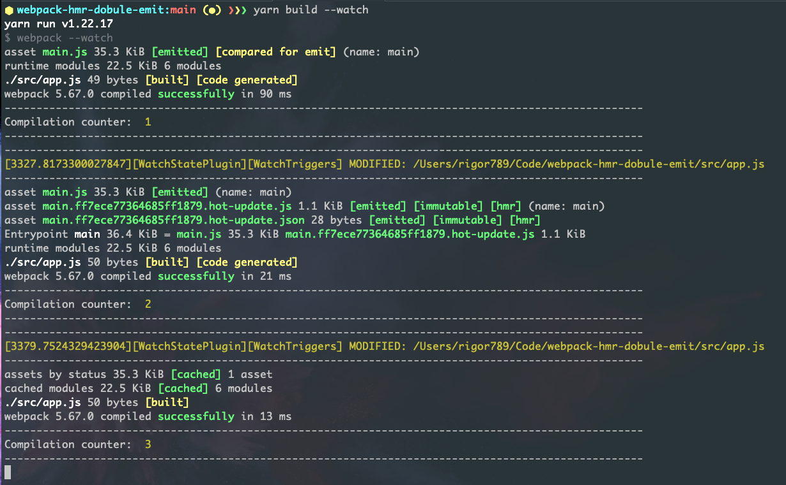

# Webpack Double-Compilation issue

Steps to reproduce:

1. clone repo
2. `yarn` (or `npm install`)
3. `yarn build --watch`
4. make a change in `src/app.js` to trigger HMR
5. observe logs, compilation counter is at 3 instead of 2

